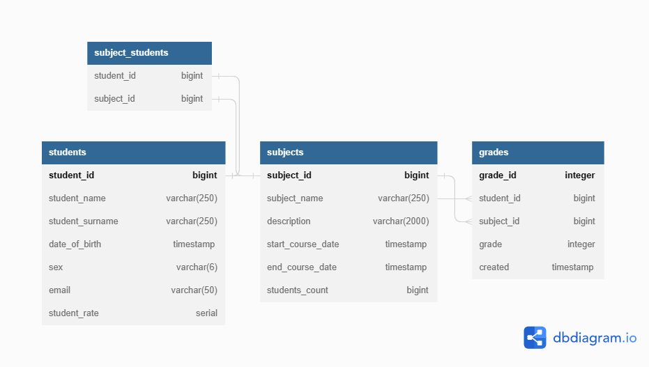

# test_task_digital_chief
Repository for a test task for Digital Chief Company

Web Приложение Students позволяет сохранять и загружать данные студентов, учебные предметы, по которым они обучаются и оценки за успеваемость.
Возможно добавление, редактирование, удаление студентов и учебных предметов, выстввление оценок. Возможно получение данных конкретного студента или всех студентов с возможностью сортировки по средней оценке как по возрастанию, так и по убыванию. А также можно ограничить выборку по количеству и началу выборки. Возможно получение всех оценок студента по предмету.

Програмные модели, реализованные в данном приложении:

student - содержит уникальный номер (ID), имя, фамилию, дату рождения, пол, адрес электронной почты и среднюю оценку студента

subject - содержит уникальный номер (ID), название, описание, начало и окончание курса и количество студентов, обучающихся по этому учебному предмету

grade - содержит уникальный номер (ID), уникальный номер (ID) студента, уникальный номер (ID) предмета, оценку, и дату выставления оценки

Для сохранения данных о студентах, обучающихся по конкретному предмету реализована дополнительная таблица subject_students.

Приложение развертывается в двух Docker контейнерах, один для базы данных и другой для самого приложения.

После скачивания и распаковки архива запуск приложения возможен с помощью скрипта start.sh, остановка с помощью stop.sh Приложение загружает с GitHub последнюю версию приложения, собирает и запускает Docker image.

Для тестирования в приложение есть Postman коллекция, содержащая тесты на все реализованные эндпойнты и файл data.sql для обнуления данных при тестировании.

При необходимости приложение можно легко масштабировать, добавить новую функциональность и разделить на модули.

В приложении подключены зависимости: spring-boot-starter-web, spring-boot-starter-data-jpa, spring-boot-starter-validation, postgresql, lombok, spring-boot-starter-test

Стек технологий: Java11, Spring Boot 2.7, Maven, PostgreSQL, Lombok, Spring JPA, REST, Docker, Hibernate

## Схема БД 

